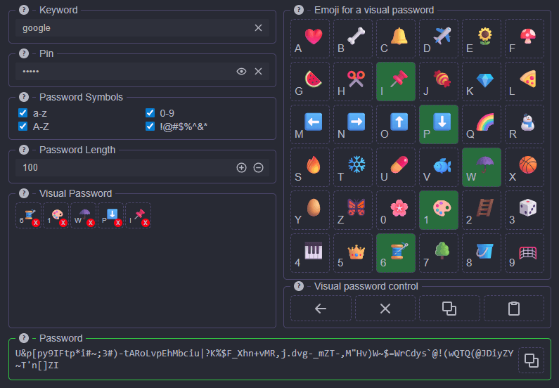

[<a href="docs/README-RU.md">Русский</a>]

# Visual Password

A generator for strong and secure passwords using simple actions that are easy to remember and don’t need to be written down. This makes your passwords 100% secure because they cannot be stolen.

Don’t store your passwords in a password manager, notes, or on paper. Simply memorize a few emojis and a keyword to instantly recover a complex password when needed.

Visual Password generates passwords entirely locally on your device. No internet connection required. It does not store any generated passwords.

To create passwords, Visual Password uses a multi-layered cryptographic password-generation algorithm that takes your input data (keyword, PIN, visual password). It applies multi-stage AES-GCM encryption, bit mixing for maximum entropy, and multi-stage SHA-256 hashing for cryptographic strength. PBKDF2 key derivation protects against rainbow-table attacks and adds computational complexity beyond the reach of modern supercomputers. Multiple cascade-encryption layers enhance overall resilience and provide cryptographic redundancy. The final step uses a high-entropy pseudorandom generator based on cryptographically secure data, ensuring the uniqueness and complexity of the password even with very similar inputs.

# Usage Recommendations

- Keyword field: Enter something that characterizes your password’s purpose, e.g., `google`, `facebook`, etc.

- PIN field: Enter any string (e.g., `123a`). The PIN increases entropy and reduces collision probability with other users.

- Character set & length: Choose your desired character set and password length.

- Visual Password field: Enter a sequence of emojis. To help memorization, use not only their pictures but also the alphanumeric labels on each emoji button and the color variations when pressing an emoji.

The same combination of input data will always produce the same password.

1. Copy the generated password.
2. Close Visual Password.
3. To retrieve the password later, simply re-enter the same inputs.

# License

Attribution-NonCommercial 4.0 International

# Third-party libraries

- [MonoIcons](https://icons.mono.company/)