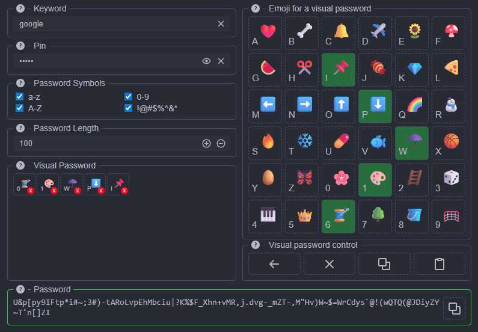

[<a href="docs/README-RU.md">Русский</a>]

# Visual Password

Visual Password — helps you easily recover strong passwords without writing them down or storing them in password managers. You just memorize a couple of emojis and a keyword. When you need a password, use a combination of them to instantly create a long, complex password right on your device.

Everything happens locally: no servers, internet, or databases — Visual Password does not send or save your passwords.

Simply put, you only keep small hints in your head, and Visual Password turns them into a really strong password.

# Usage Recommendations

- Keyword field: Enter something that characterizes your password’s purpose, e.g., `google`, `facebook`, etc.

- PIN field: Enter any string (e.g., `123a`). The PIN increases entropy and reduces collision probability with other users.

- Character set & length: Choose your desired character set and password length.

- Visual Password field: Enter a sequence of emojis. To help memorization, use not only their pictures but also the alphanumeric labels on each emoji button and the color variations when pressing an emoji.

The same combination of input data will always produce the same password.

1. Copy the generated password.
2. Close Visual Password.
3. To retrieve the password later, simply re-enter the same inputs.

# Installation

Latest release [https://github.com/viruseg/VisualPassword/releases](https://github.com/viruseg/VisualPassword/releases)

### HTML-file
Download VisualPassword.Web.html and run it locally or place it on any hosting. Limitation: It will not work over the http protocol.

### Android
Download VisualPassword.Android.apk and install it on your phone.

### Google Chrome, Edge
Download VisualPassword.Chrome.Extension.zip and unzip to any folder.
Open the chrome://extensions page.
Turn on developer mode in the upper-right corner.
Click Download the unpacked extension.
Find and select the folder with the unpacked extension.

### Firefox
Install via [Firefox Browser Add-ons](https://addons.mozilla.org/firefox/addon/visual-password/).

### Telegram
[@VisualPassword_bot](https://t.me/VisualPassword_bot)

### Web

[https://visualpassword.pages.dev/](https://visualpassword.pages.dev/)

[https://viruseg.github.io/VisualPassword/](https://viruseg.github.io/VisualPassword/)

# License

Attribution-NonCommercial 4.0 International

# Third-party libraries

- [MonoIcons](https://github.com/mono-company/mono-icons)
